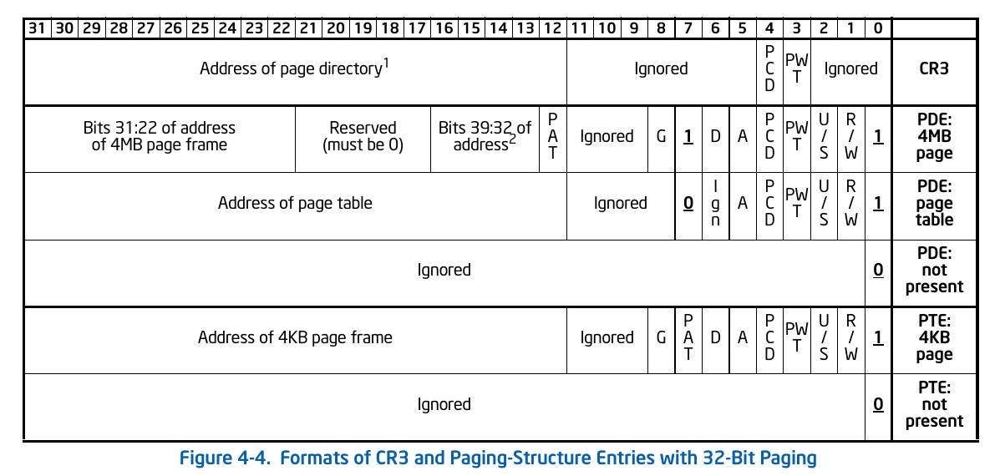

# Lab2 Report

## [练习1]  实现 first-fit 连续物理内存分配算法

****

#### 原有程序的问题

Lab2原先的代码已近形成了雏形，可以作为一种分配方式实现初始化、分配、回收等过程。

但是对于空闲页表块的初始化、分配、回收的时候，都是将页表块直接添加在链表头上，完全没有顺序，可以认为是个随机算法。因此也不能通过basic_check()的检查。

#### 我的程序实现

通过阅读函数调用关系，可以发现在pmm.c文件的pmm_init()函数中，调用了page_init()，在page_inti()中根据探测到的物理内存分布以及大小，确定分页后的页面的数量，并将所有页面初始化为“Reservered”；之后开始实现空闲标记，即初始化memmap，调用default_init_memmap。

这个过程中，倒着循环遍历链表，找到第一个地址小于base的页面项p，跳出循环，将base插在p之后。由于最开始free_area链表为空，按照这个方法插入，就能够保证链表有序。程序实现如下：

```c
static void (struct Page *base, size_t n) {
    // other code
    list_entry_t *le = &free_list;
    while( (le = list_prev(le)) != &free_list  ) {
    	struct Page *p = le2page(le, page_link);
    	if(p < base) break;
    }
    list_add(le, &(base->page_link));
}
```

分配内存的时候，如果空闲块大小大于所需，现将剩余部分插在此页面之后，然后再将此页面从链表中删除。就能保证链表仍然按照地址升序排列，代码如下：

```c
static struct Page * default_alloc_pages(size_t n) {
    // other code
    if (page != NULL) {
        if (page->property > n) {
            struct Page *p = page + n;
            p->property = page->property - n;
            list_add( &(page->page_link), &(p->page_link)); //先插入剩余空闲块
        }
        list_del(&(page->page_link)); // 然后再删除原先的空闲块
        nr_free -= n;
        ClearPageProperty(page);
    }
    return page;
}
```

回收内存的时候，现将页面插入到合适的位置（方法同init过程），然后跳出循环。如果此时发生合并现象，一定是和链表中的前一项或者后一项，由于我们在循环过程中记录了前一项和后一项，直接判断能否和后一项合并，如果可以，修改空闲块信息，链表中删除后一项；再判断和前一项是否可以合并，如果可以，修改空闲块信息，链表中删除当前项。保证了合并之后仍然有地址升序排列。代码如下:

```c
static void default_free_pages(struct Page *base, size_t n) {
	// other code
    list_entry_t *le = &free_list, *next_le = NULL;
    // 找到合适的位置
    while( (next_le = list_next(le)) != &free_list  ) {
    	p = le2page(next_le, page_link);
    	if(p > base) break;
    	le = next_le;
    }
    // 线插入当前表项
    list_add(le, &(base->page_link));
    // 判断后一项是否存在
    if( next_le != &free_list ) {
    	p = le2page(next_le, page_link);
    	if (base + base->property == p) {	// 判断后一项是否和当前项满足合并要求
    		base->property += p->property;
    		ClearPageProperty(p);
    		list_del(&(p->page_link));	// 从链表中删除后一项
    	}
    }
    // 判断前一项是否存在
    if( le != &free_list ) {
    	p = le2page(le, page_link);
    	if (p + p->property == base) {	// 判断前一项是否和当前项满足合并要求
    	    p->property += base->property;
    	    ClearPageProperty(base);
    	    list_del(&(base->page_link));	// 从链表中删除当前项
    	}
    }
    nr_free += n;	// 不要忘了空闲页面数量增加
}
```

#### 改进空间

+ 在ucore的体系中，defalut_init_memmap实际上可以直接插在&free_list之前，也就是插在链表的最后一个。
+ 关于合并的时候需要遍历整个链表查询所在位置，其实对所有空闲块可以再维护一个链表，当出现拆分的时候，记录他的下一块和上一块。在回收内存的时候判断下一块和上一块是否在free_list中，如果在就直接插在相应的位置，并将两者合并。

#### 和参考代码对比

+ defalut_init_memmap参考代码就是直接list_add_before()，把base插入在链表的最后一个。我的方法略复杂，但如果遇到不是按顺序插入的情况，我的程序鲁棒性更高。
+ default_alloc_pages两边实现的差距不大，基本就是把demo程序从链表中删除的顺序调整了一下。
+ default_free_pages中，我是先找到合适的位置插入，然后判断前后位置，把相应页表项从链表中删除。而参考答案时在循环过程中把前后符合合并要求的先删除，最后再找到位置插入。我的效率应该要高一些。


## [练习2]  实现寻找虚拟地址对应的页表项

我最开始没有注意到实验指导书中的提示，完全按照get_pte()函数的注释写代码。可以说注释写的很详细，首先根据pgdir和PDX(la)找到对应的页目录项。需要注意对于create的理解，当发现pde的present位为0时，先检查create是否为真，否则返回NULL。关于permission以及页表项的具体内容，查看《Intel@64 and IA-32 Architectures Software Developer's Manual, Volume 3, Section 4.3 32-Bit Paging》。

关于地址有一点点小坑，就是memset接受的第一个参数时核虚拟地址，而不是分配页面返回的struct Page*。具体代码如下：

```c
pte_t * get_pte(pde_t *pgdir, uintptr_t la, bool create) {
	pde_t *pdep = pgdir + PDX(la);
    if( ((*pdep)&1) != PTE_P) {
     	if(!create) return NULL;
    	struct Page * p = alloc_pages(1);
    	if(p == NULL) return NULL;
    	set_page_ref(p, 1);
   		uintptr_t pa = page2pa(p);
   		//cprintf("p = %0x , pa = %0x , KADDR(pa) = %0x\n", p, pa, KADDR(pa));
   		memset(KADDR(pa), 0, PGSIZE);
   		*pdep = ((PPN(pa) << PTXSHIFT) | PTE_U | PTE_W | PTE_P);
    }
    return (pte_t *)KADDR(PDE_ADDR(*pdep)) + PTX(la);
}
```

#### [练习2.1] 请描述页目录项（Page Directory Entry）和页表项（Page Table Entry）中每个组成部分的含义以及对ucore而言的潜在用处。

根据Inter手册，CR3、PDE、PTE的32位构成如下：



其中PDE组成：

| bit位   | 表示内容                                | 潜在用处                                     |
| ------- | :-------------------------------------- | -------------------------------------------- |
| 0 (P)   | Present为1才表示映射到一个物理页        | ucore判断对应页表是否存在，不存在时创建      |
| 1 (R/W) | 可读可写控制                            | ucore对某一页保护时，设置此位，控制权限      |
| 2 (U/S) | 0表示user-mode下不能访问对应引用        | ucore通过此位决定用户态、内核态的访问权限    |
| 3 (PWT) | 页级别的写直达选项                      | 如果ucore需要和硬件cache交互，这些位很关键   |
| 4 (PCD) | 页级别的cache禁用选项                   | 同上                                         |
| 5 (A)   | 表示软件能否访问                        | Access和Dirty位供ucore内存管理单元在转换页表 |
| 6 (D)   | Dirty位，表示对应页应用是否被软件修改过 | 到物理地址的过程总使用                       |
| 7 (PAT) | 不设置PAT时，必须为0                    |                                              |
| 8 (G)   | 全局选项                                | 控制TLB地址的更新策略                        |
| 11:9    | 保留位                                  |                                              |
| 31:12   | 对应4-KB页的高20位物理地址              | ucore通过这20位获得二级页表基址              |

PTE实际上组成和PDE一样，除了最后31:12位表示实际页物理地址基址，其他都一致。

#### [练习2.2] 如果ucore执行过程中访问内存，出现了页访问异常，请问硬件要做哪些事情？

ucore的MMU模块在进行访存操作时，会进行二级页表查找，如果pde或者pte的present位为零，即对应页表不存在，就会产生Page Fault中断（中断号为14），此时CPU会进行一下操作：

+ 保存现场，保存各个寄存器的值。
+ 设置相应的寄存器记录当前出错程序的地址信息，压入栈中。
+ 修改特权级，进入内核态。
+ 根据中断号，从IDT表中找到中断服务例程的地址，通过中断门的优先级检查。
+ 跳转到ISR起始地址，执行ISR。

如果发生了double fault异常，即却也异常处理中产生缺页异常，CPU就不能处理了，往往由于操作系统编码有误。


## [练习3]  释放某虚地址所在的页并取消对应二级页表项的映射

释放二级页表项和创建二级页表项对应，首先检查pte的present位是否为1，如果为0就不需要处理。如果为1，找到对应页，把引用数减一，当一个页的引用数为0的时候，将此页回收，最后记得通知TLB更新。

具体代码如下：

```c
static inline void page_remove_pte(pde_t *pgdir, uintptr_t la, pte_t *ptep) {
    if (*ptep & PTE_P) {	// 检查present位
        struct Page *page = pte2page(*ptep);	// 查找对应页
        if (page_ref_dec(page) == 0) {	// 页引用减一，并判断是否为0
            free_page(page);  // 引用数为0时，回收对应页
        }
        *ptep = 0;	// pte初始化
        tlb_invalidate(pgdir, la);	// 通知TLB更新
    }
}
```

#### [练习3.1] 数据结构Page的全局变量（其实是一个数组）的每一项与页表中的页目录项和页表项有无对应关系？如果有，其对应关系是啥？

Pages是用于管理物理的连续内存，数组中的每一个Page对应物理内存中的一页。页目录也是物理内存中的一页，也就是Pages数组中的一项，大小为4KB，其中每4个Byte构成的32位为一个页目录项，所以总共$2^{10}$个页目录项，每个页目录项指向一个页表的地址.

页表也存在与物理内存的页中，即为Pages数组中的一项。同样大小为4KB，每4个Byte构成的32位为一个页表项，所以总共$2^{10}$个页表项，每个页表项指向物理内存中一页的地址。通过这个地址就能找到对应的Page。而一个页表中连续的页表项，对应的Pages结构也是连续的。

需要注意的：所有的页目录、二级页表时存放在物理内存中的，属于Pages数组指向的一项，Pages数组本身存储在单独的内存区域内。

#### [练习3.2] 如果希望虚拟地址与物理地址相等，则需要如何修改lab2，完成此事？

+ 首先bootloader阶段，启动段机制，线性地址与物理地址相等，无需修改
+ lab2中，内核启动时，进入kern_entry，需要删掉gdt中的KERNBASE的有关内容，同时修改ucore其实虚拟地址为0x00100000（4M的ucore内核），而不是0xC0100000。
+ 在enable_paging函数到gdt_init函数过程中，页机制和段机制对于0xC0100000的偏移时叠加的，修改KERNBASE为0，取消VPT的递归自映射。
+ 此时页机制完全启动，虚拟地址等于物理地址。


## 本人实现与参考答案的区别

+ 练习1：已经在相应的小节内写过了。
+ 练习2和练习3本身结构很像，主要在于细节上的处理不太一样。比如在获取页目录项时，参考代码用数组下表+地址符的方式获得Index为PDX(la)的页目录项，即pdep = &pgdir[PDX(la)]，而我则直接将他们当做地址，用pdep = pgdir+PDX(la)。返回页表项的时候也是存在这样的差异。但整体而言差距不大。


## 与OS原理课相关知识点

+ 练习1：计算机体系结构和内存层次，段页式机制的建立过程，连续物理内存分配策略。
+ 练习2和练习3：页式储存管理和多级页表的建立与访问，页目录项和页表项结构。

## OS原理课没有提到的知识点

- 探测物理内存分布和大小
- 内存回收机制